# 小作文

## 一、开头段

> 通过改写题目来描述任务，开篇

### 1. 常用替换词

- 替换
  - 单词
  - 短语
  - 抽象 <-> 具体

- 诸如 chart / graph / table  有关图表类型词不替换 但可以根据具体类型加上 pie（饼图） bar（柱状图）
- 把 below 去掉

#### 1.1 问题结构词

- Show 展示
  - provides the information about
  - (given) illustrate(s)
  - (given) demonstrate(s)
  - reveal
  - present
  - show / give  / provides information(data) about / with regard to / regarding / concerning 
  - compare(如为对比)
  - ~~As is given in the illustration, ...~~
- Proportion 部分/比例
  - percentage 
  - rate
  - ratio
  - share 份额
- Category 种类（categories）
  - kinds
  - types
  - classification
  - sort
- in 时间
  - 静态图
    - in the year of
  - 动态图
    - in three(几个) different years.
    - **between the time period of ... and ...**
    - **spanning / ranging from ... to ...**
    - among
    - in range of
    - form to
- `the quantities of 数量`
  - 不可数
    - how much
    - the amount of
    - **the figure for**
    - **the quantities of**  
  - 可数
    - how many
    - the number(percentage) of
    - the figure for
    - the quantities of
- Different 不同的/多种的
  - various 
- ways 方式 
  - modes
  - means
  - methods

##### 静态图

例：The chart below show**s** the destination of students graduating from physics and art in the UK in 2007

改：The `bar` chart `given compares` the choices of graduates from arts and physics in Britain `in the year of` 2007

例：The table below show**s** the proportion of different categories of families living in poverty in Australia in 1999

改：The table `given demonstrates` `how much various types of` Australian households suffered from poverty in 1999

##### 动态图

例：The graph below shows the quantities of goods transported in the UK between 1974 and 2002 by four different modes of transport. 

改：The graph `provides the information` about the amount of goods transported in the United Kingdom by four means of transport between the time period of 1974 to 2002

例：The chart below show**s** the destination of students graduating from physics and art in the UK in 2007

改：The `bar` chart `given compares` the choices of graduates from arts and physics in Britain in the year of 2007

#### 1.2 其他

- occupy 占据（最高）
  - rank
  - gain
- meanwhile 同时
  - moreover
  - In terms of 在...的方面
- think 认为
  - opine
  - state that 表示
  - believe that
  - **...give their opinion that... 谁认为什么**
  - ....seems like have a different opinion as they believe that... 某人似乎有不同的看法，因为他认为

- `on the contrary相反`
  - ，on the contrary，可前置后置 
  - There was an opposite trend in 
  - by contrast
- changes 改变
  - variations
- as 关于
  - in terms of

#### 1.3 改写练习

## 二、概述段

### 常用替换词

- overall 总之
  - globally
  - generally
  - in general
  - apparently
  - It is obvious / noticeable / self-evident / apparent （from the chart）that

## 三、主体段

> 更多例题参考原ppt

### 1. 动态图

**要分析数据的选择**

**1. 最高值**最重要，必定要读，也要强调

**2.** 然后是**最后一个时间点**的数据其次是**第一个时间点**的数据（因为第一年和最后一年的数据差别可以确定趋势到底是上升还是下降）

**3.** 其他数据可以自己选择

#### 常用替换词

##### 1 **趋势的表达**

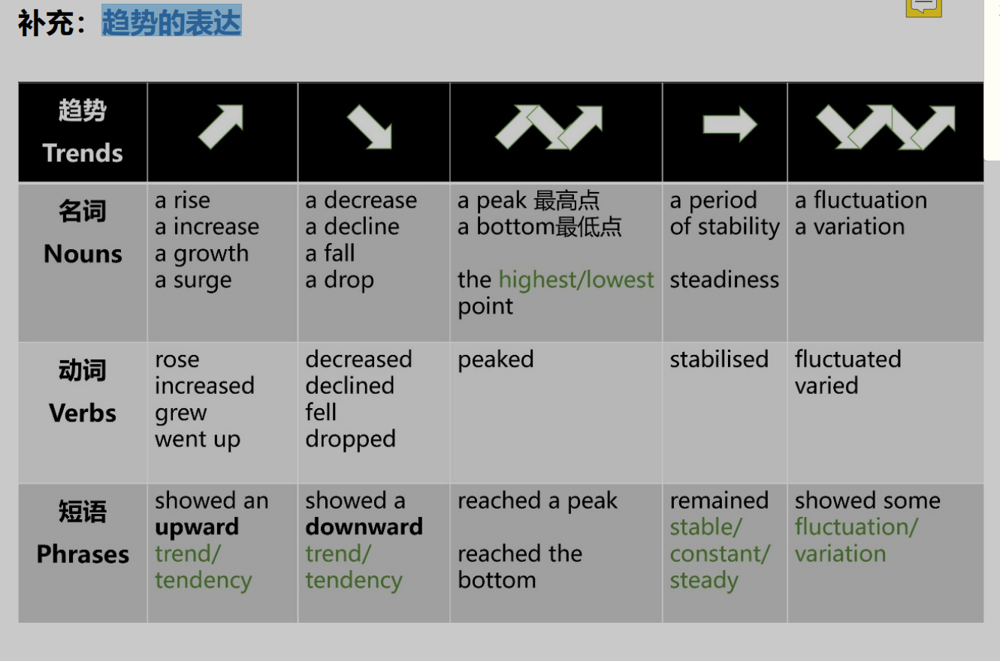

##### 2 变化的表达

- 数据体现

  - 具体数据 -> 6% 

  - 大约数据 -> 几分之几/都高于多少

  - 区间 -> 50% ~ 60%

- 数据变化

  - 剧烈的变化
  - 轻微的变化
  - 与其他的对比，是....的（几分之几）三分之一变化量
- **稳定在某一水平** remain stable/ steady at / level off at 

- **占多少份额/百分比** , account`ing` for/ make up/ represent
- **变成原来数值的两倍/三倍**`(nearly)`double, twice, triple, four-fold
- **原有的差距缩小/增大** The gap between …and …narrows/ widens

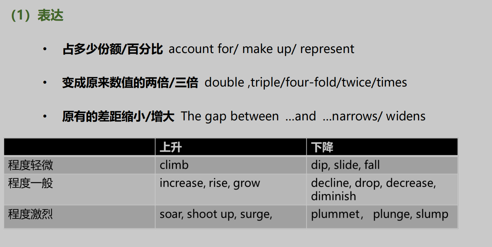

##### 3 激烈程度

-  **持续的** gradual , continuous, steady, slow
-  **大约** about, around, approximately, just over, just under
-  **分别** respectively

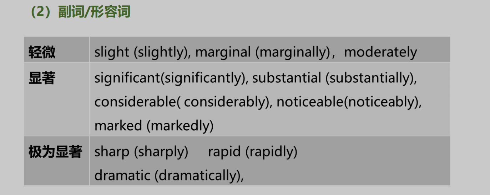

#### 1.1 **第一大句型：**描述趋势（上升、下降、不变、波动）

1. `(There be)`**There** **was/is/will be** **a adj+ n. in the** **number/percentage of** **(A)（data）time period.** 

   > **有一个  变化 (in)什么的 在什么时候变了多少**

   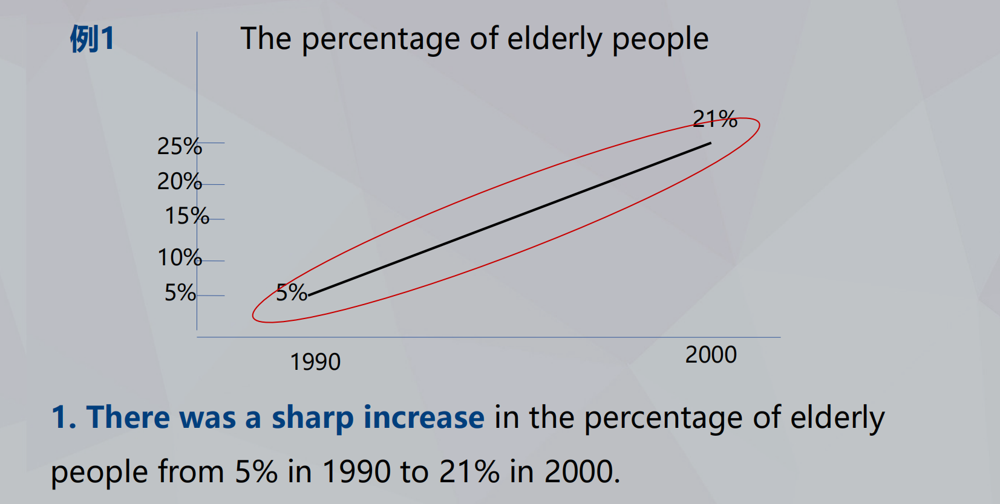

   

2. **The** **number/percentage** **of (A) v.+ adv. (data) time period.**

    > **什么的 变化 在什么时候变了多少**

    **The percentage of** elderly people increased sharply from 5% in 1990 to 21% in 2000

    The proportion of the olds rose rapidly from 5% in 1990 to 21% in 2000

   

3. **Time period** **witness/see** **a adj.+n. in the** **number/percentage** **of** **(A)（data）.**

   > **在什么时候  (witness)变化 (in)什么的 变了多少**

   （**Time period 通常为** the 5 years，the next 4 years，）

   `The period from 1994 to 1998` witnessed ...
   
   **The period between** 1990 and 2000 witnessed/ saw/ experienced a sharp increase in the percentage of elderly people from 5% to 21%
   
   

#### 1.2 第二大句型：描述最高值最低值（一个对象在一段时间之中的最高点和最低点）

（在一篇文章中，以下三个小句型最多各出现一次）

1. **It** **reached/reaches/will reach** **its** **highest point/peak/lowest** **point/bottom** **at (data) time.**（建议与上一个句型写成并列句）

   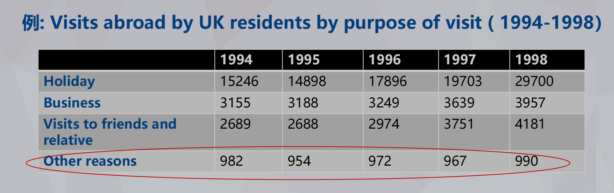

   The period from 1994 to 1998 saw a fluctuation in the number of other reasons **and** **it reached its lowest point at 954 in 1995.**

   

   

2. **上升/下降：peaking/bottoming at data（time）**

3. **上升/下降：reaching its** **highest point/peak/lowest point/bottom** **at** **data（time）**

   The number of holiday increased sharply **until**(一直增长) 1998**, peaking at 29700 in 1998.**

   The number of holiday increased sharply until 1998**, reaching its highest point** **at 29700 in 1998**
   
   `The percentage of holiday rise dramatically until 1998, reaching its bottom at 14898 in 1995.`

#### 1.3 常用三大高级句式(动态图)

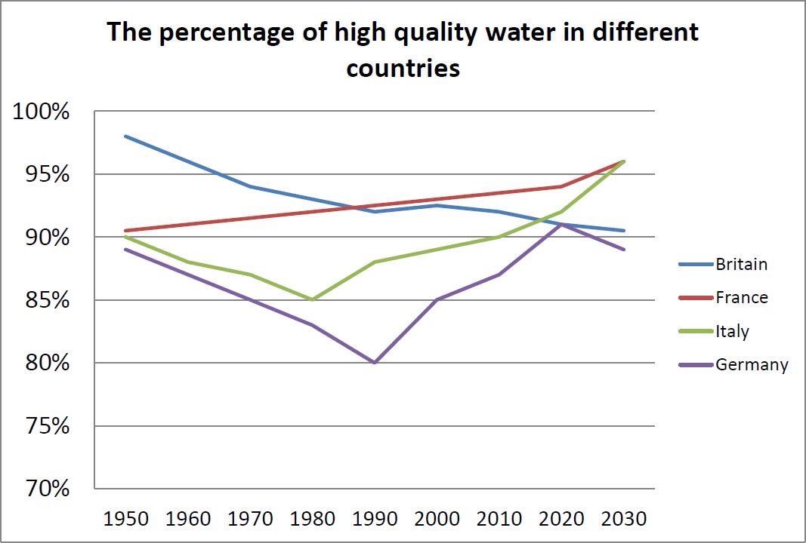

##### （1）第一大句型：分词结构

1. 电力供应差不多增长两倍（double），从 50 涨到 100。

   Electricity supply **nearly doubled** ，**rising** from 50 to100.

2. 开荒（land clearance）是上地退化（degradation）的主要原因，占据了 10%。

   Land clearance was the main reason for degradation ，**accounting for** 10%.

3. **英国数值的趋势预料会继续持续，在 2030 年几乎下降到91%。**

   The trend in ``the figure for`` Britain `is expected to` continue, **dropping** **to almost 91% in 2030.** 

4. **法国高质量水的比例被预测有一个升幅，在 2030 年到 96%**

   The proportion of high-quality water in France ``is projected to`` show an upward trend, **reaching 96% in 2030**

##### （2）第二大句型：定语从句

 **用 after which ，during which time ，where 等引导的定语从句**

1. 手机用户的数量在 2005 上升到 2 百万，在那之后数字保持平。

   The number of mobile phone users rose to 2 million in 2005 ，**after which** the figure **remained constant.**
   
1. **意大利高质量水的比例在 1980 年左右下降到 85%，之后在2030** **年预测上升到 96%**

   The proportion of high-quality water in Italy dropped to 85% in around 1980, **after which it will rise to 96% in 2030.** 

##### （3）第三大句型：状语从句

**用 while，或者 although 引导的状语从句，或者是 but 引导的并列句**

1. 结婚的数字上升，而离婚的数字下降。

   The number of marriages rose ，**while** the number of divorces dropped.

2. 虽然读科学的男生比女生要多，这个数字在下降。

   **Although** men outnumbered women in science ，this number declined.

3. **德国的数值可能在 2020 年上升到 92%，虽然它可能在 2030 年下降到 88%**

   The figure for Germany is likely to rise to 92% in 2020, **although** it will possibly decline to 88% in 2030. 

4. **当高质量的水的比例在英国下降时，法国的数值显示出一个相反的趋势。**

   The proportion of high-quality water in Britain declined, **`while` the figure for France showed the opposite trend.** 

#### 1.3 句式练习

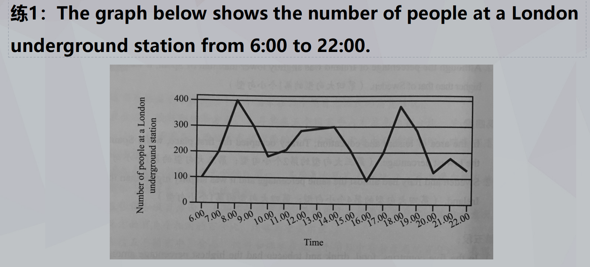

**1. 这个数字急剧上升，在上午8点达到最高点，是400。** **提示：**（第一大句型的第2个小句型；第二大句型的第2个小句型）

The number of people in the station shoots up until 8：00 a.m.，peaking at 400.

**2.但是，这个数字在接下来的2个小时急剧下降。** **提示：**（第一大句型的第1个小句型）

However，there is a drastic drop in the number of people in the station over the next two hours.

**3. 这个数字在上午10点到12点从180适度增加280** **提示：**（第一大句型的第3个小句型）

The period between 10:00 a.m. and 12:00 noon witnesses a moderate growth in the number of people in the station, with the number reaching 280 at mid-day.

**4. 从12点到下午2点，这个数字几乎没有变化。然后，这个数字从下午2点到4点** **急剧下降。在下午4点达到最低点100。** **提示：**（第一大句型的第1个小句型；第一大句型的第2个小句型；第二大句型的第1个小句型）

There is little change in the number of people in the station from 12：00 noon to 2：00 p.m.，and then the number plummets until 4：00 p.m. , and it reaches its bottom at 100.

**5. 接下来的2个小时，这个数字再次剧** **烈上升。** **提示：**（第一大句型的第3个小句型）

The next two hours see a dramatic rise in the number of people in the station again.

#### 1.4 **主体段分段思路**

##### 原则1 三个年份（时间段）及以上数据

1. 分段1

   - 下降的数据

   - 上升的数据

   - 不变的数据

2. 分段2

   - 比较高的值（极值）
   - 其他值
   - （最低值）

##### 原则2 两个年份（时间段）数据

1. 第1个年份的数据特征分析
2. 两个年份中的数据对比

#### 1.5 总结段

① 动态图的结尾段总结趋势的对比，**常用while**这个词

② 不要总结所有的信息，**选择你觉得重要的信息**（一般是2-3个）

③ 不要出现**数据**

④ 不要出现**in conclusion**

#### 1.6 例题1（两年数据）

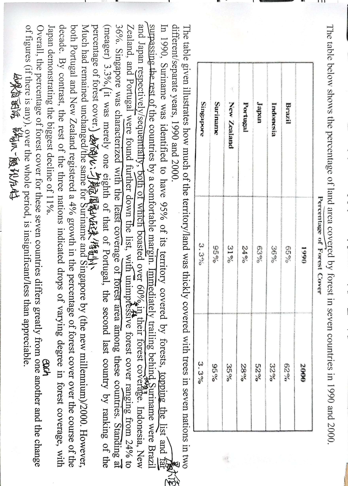

遵循原则2：

1. 第1个年份的数据特征分析
   1. 最高值
   2. 从高到低值
   3. 最低值
2. 两个年份中的数据对比
   1. 不变的
   2. 变化的（变化大的或者小的）

#### 1.7 例题2（三年即以上数据）

**The graph below shows the** **number of new homes built in a** **particular region in the UK from** **2012 and the figure predicted** **for 2022.**

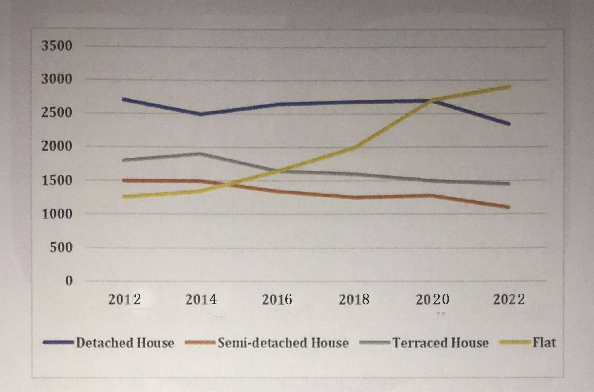

##### 1开头段

##### **主体部分第一段**（**最大值** **Detached House**）

The number of detached house was the largest from 2012 to 2020 among 4 kinds of homes, **with** the figure remaining stable at around 2600, **although** **it** **was predicted** to decrease markedly in the following 2 years

##### **主体部分第二段**（其他值）

**Terraced House**

Terraced House 2012到2014有轻微提升，再此期间semi-detached house持平在1500（第一大句型第二小句型+定语从句）

The figure for terraced house rose slightly from 2012 to 2014, **during which time** the number of semi-detached house remained stable at 1500. 

**Semi-detached House** 

2022前两者有轻微下降，同时十年来terraced house比Semi-detached House 更多 （there be句型+比较级）

**Afterwards,** the figures for the two kinds of homes will experience a modestly falling trend until 2022. Over the decade, there were more terraced houses than semi-detached houses in this region.

**flat**

从2012到2022 flat 持续上涨超越其他三个对象从这之后flat将会最大

The number of flat shown an upward trend from 1300 in 2012 to 3000 in 2022, **overtaking** that of semi-detached house in 2014, that of terraced house in 2016 and that of detached house in 2020. From that time onwards, there will be the largest number of flat built in this region

##### 3总结段（本题为**未来趋势**）

Flat将会剧烈增加，而其他则持续下降

**Overall,** the graph shows how the number of flat will grow dramatically **while** the popularity of these other homes will decrease over the period.

### 2. 静态图

**静态图表常用句式**

**句式1:** 比较级

**句式2：**倍数

**句式3：**while/whereas/but引导的从句

**句式4：**最高级

**静态图对比数据顺序:**

**方式一：**依次由高到低

**方式二：**先说最高，再说最低，然后是其他

#### 2.1 第三大句型：三个及以上对象中的第一、第二和最后

1.  **The number/percentage of (A) is/was/will be the largest/highest/lowest/smallest +time period.**

   The number of holiday was the **highest among the four reasons,** at 29700 in 1998

   **While** Canada had the least tea imported (only 20,000 tonnes). 

   > 这里的The number/percentage largest/highest/lowest/smallest都可以替换
   >
   > 例句待补充

2. **(A) had/has/will have the largest/highest/lowest/smallest number/percentage in/among range + time period.**

   **Holiday** had the **highest number** **among** the four reasons**, with 29700 in 1998**

 

3. **(A) occupy/rank the first/second/last position/place（at data） in/among range + time period.**

   The UK **occupied** the `first place` **among** the four countries, importing 160,000 tonnes of tea.
   
   From 1994 to 1996, **business occupied the second place.** 

#### 2.2 第四大句型：两个对象的比较

1. **The number/percentage of (A) was/is/will be（much/slightly） larger/higher/lower/smaller  than that of (B).**

   From 1994 to 1996, business occupied the second place, but after that, **the number of business was slightly lower than that of visits to friends and relatives**

2. **The number/percentage of (A)  was/is/will be approximately/about N times as much as that of (B).**

   孟加拉（Bangladesh）数据的11倍和美国的一样多。

   The number of Bangladesh was 11 times as much as that of USA

3. **第一位/第二位，which was/is/will be followed by (B).**

   至于衣服和鞋类这两项，意大利占据第一的位置，紧接着是土耳其（6.63%）

   As for clothing and footwear, Italy ranked the first position, **which was followed by Turkey (6.63%)**

4. **(A) and (B) had/have/will have the same number/percentage.**

   瑞典和意大利有着几乎一样的比例

   Sweden and Italy had almost the same percentage

#### 2.3 **主体段分段思路**

##### **原则1：**动态单图/表按照对象分段

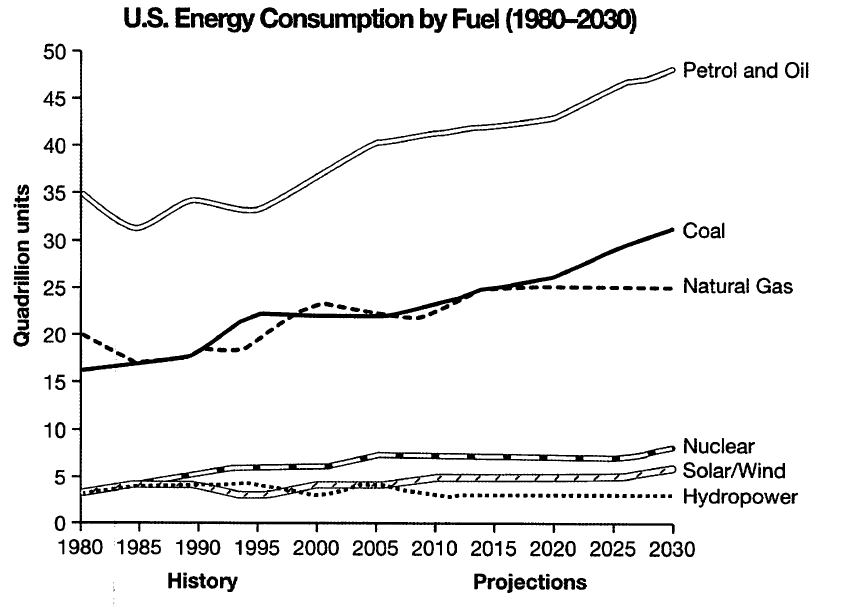

本图是动态单图，反映6种能源的消耗量，那么就按照能源分段

##### **原则2：**多图/表如果单位一致，描述的对象一致**，则按照对象分段**

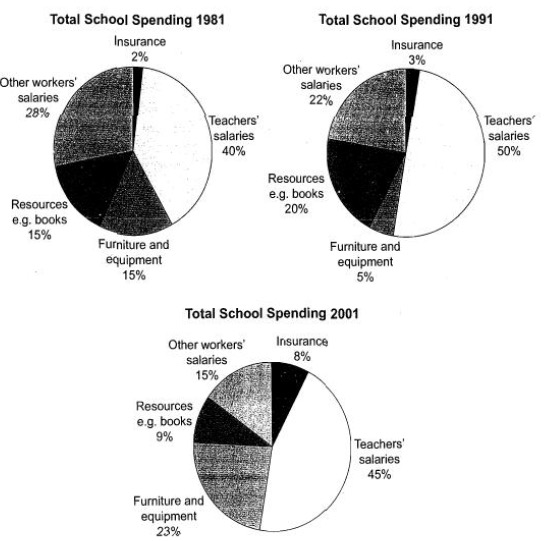

本图是三个图，但是这三个图单位一致，那么这三个图可以看作一个单图。因此按照这五个考虑的因素来分段

##### 原则3：**多图/表如果单位不一致，描述的对象不一致，那么按照图/表来分段**

本题是一个图和一个表，两者描述的东西不同，按照图/表来分段，每个图/表各写一段

#### 2.4 句式练习

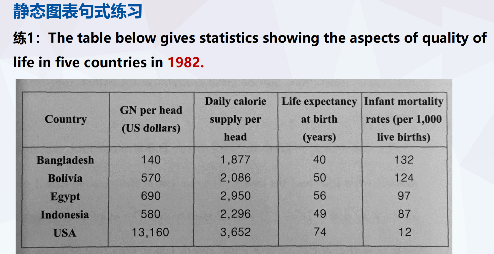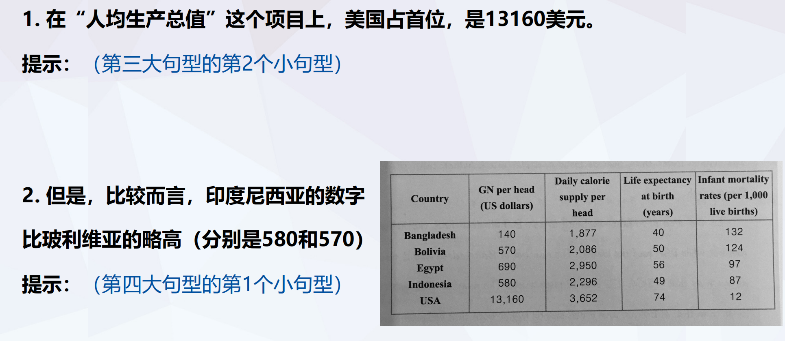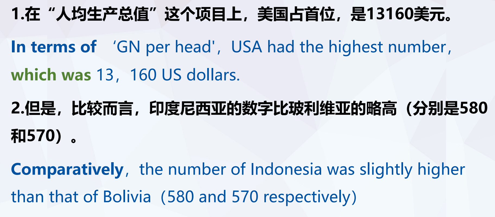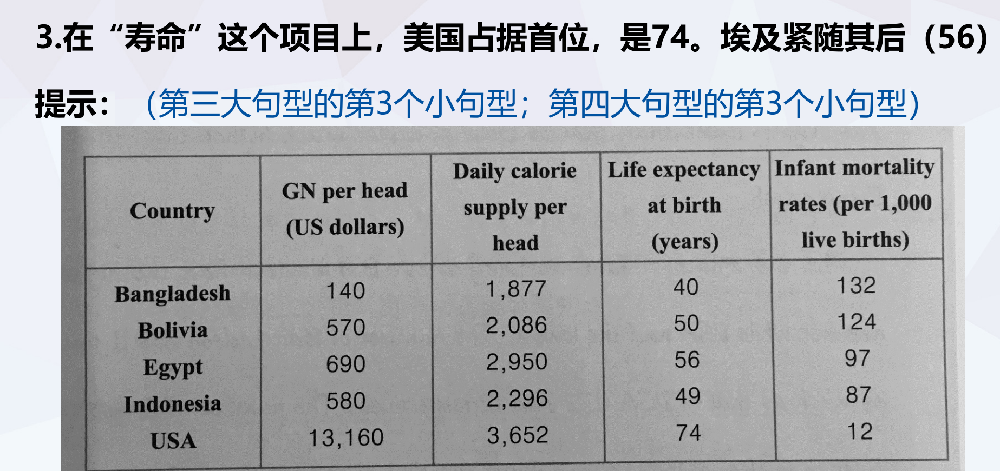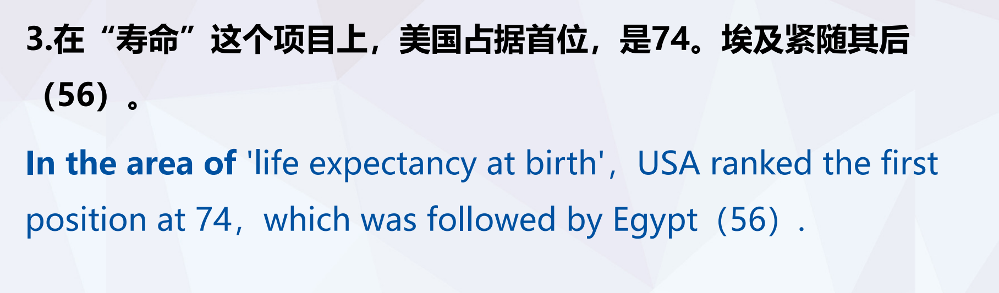

#### 2.5 例题1

**The chart below shows the amount (in tonnes) of coffee** **and tea imported from four countries in 2007**

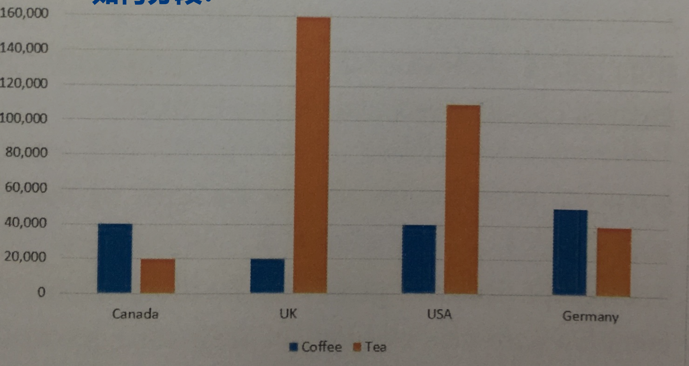

分析

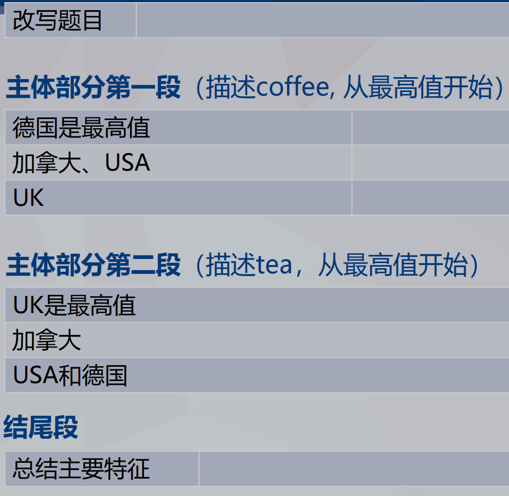

##### 1开头段

The bar chart presents the quantity of coffee and tea which were imported from Canada, the UK, the USA and Germany respectively in 2007

##### **主体部分第一段**（描述coffee, 从最高值开始）

德国是最高值（第三大句型的第三小句型）

Germany ranked first position with the amount of approximately 50,000 tonnes, 

紧跟其后是加拿大和美国（第四大句型的第三小句型）

Which followed by Canada and the USA, and they both had 40,000 tonnes. 

UK最低

The UK with 20,000 tonnes, however, laid last.

##### **主体部分第二段**（描述tea，从最高值开始）

UK的tea第一位（第三大句型的第三小句型）

The UK occupied the first place among the four countries, importing 160,000 tonnes of tea.

但是Canada的tea是最少的（第三大句型的第一小句型）

**While** Canada had the least tea imported (only 20,000 tonnes). 

USA和德国的tea分别是110,000和40,000 

Tea imported from the USA and Germany was 110,000 tonnes and 40,000 tonnes respectively

##### 2总结主体段（增加衔接）

**主体一段：`As is shown in the chart`, in terms of coffee imported from the four countries,** Germany ranked first with the amount of approximately 50,000 tonnes, which followed by Canada, and they both had 40,000 tonnes. The UK with 20,000 tonnes, however, laid last.

**主体二段：** **On the other hand, as for tea,** The UK occupied the first place among the four countries, importing 160,000 tonnes of tea, while Canada had the least tea imported (only 20,000 tonnes). Tea imported from the US and Germany was 110,000 tonnes and 40,000 tonnes respectively

##### 3总结段

UK和USA茶比咖啡多

而加拿大和德国则相反

同时，英国的茶和咖啡差距最大

**Overall,** the amount of tea imported in both the UK and the USA outnumbered than that of coffee. **As** **for** Canada and Germany, it showed an opposite **situation**. **Meanwhile,** the UK represented the greatest disparity between the two drinks.

#### 2.6 例题2

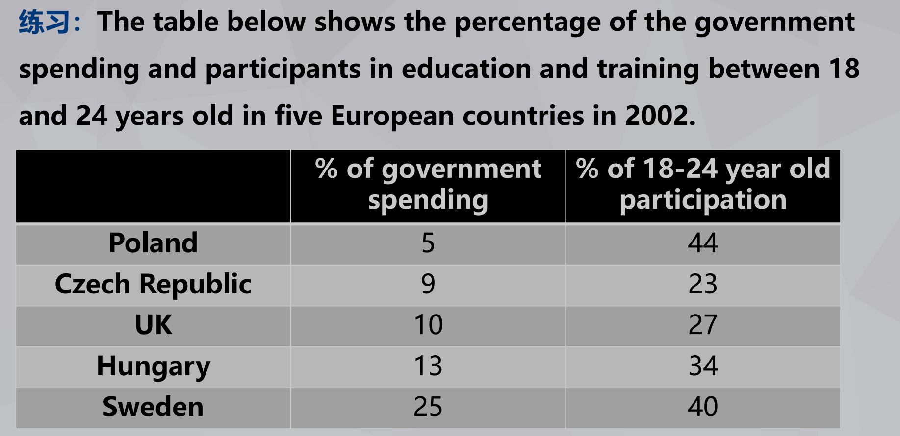

分析

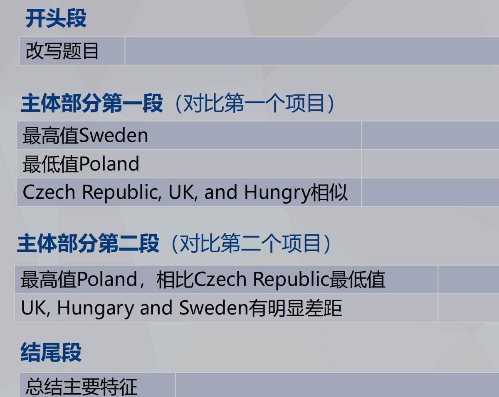

##### 1开头段

The table illustrates the proportion of the financial support to education and training given by governments from five European countries and the corresponding participation rate of the youth, aging from 18 to 24 in 2002.

##### **主体部分第一段**（对比第一个项目）

最高值是Sweden：占比25%

第三大句型第三个小句型+分词结构（数据）

Sweden occupied the dominant position, accounting for 25%. 

Poland的值最低：占比5%

第三大句型第三小句型（数据）

Poland ranked last, with only 5% was invested in education and training. 

这三个国家花费占比大约相等，都是10%

The expenditure of the remaining three countries, which were Czech Republic, UK, and Hungry, made up similar ratios, approximately 10%.

##### **主体部分第二段**（对比第二个项目）

最高值Poland占比44%，相比，最低值Czech占比23%

占比（数据）+while引导第三大句型第三个小句型（数据）

Poland accounted for 44%, which was the highest, **while** the Czech Republic ranked the lowest proportion, **with** only 23%. 

Sweden, UK, and Hungry有明显差距（数据）

There were relatively obvious gaps among other three countries, **with** Sweden constituting 40%, Hungry 34% and UK 27%

##### 2总结主体段（增加衔接）

**主体一段：** **With regard to the percentage of government spending,** Sweden occupied the dominant position, accounting for 25%, By contrast, Poland ranked last, with only 5% was invested in education and training. The expenditure of the remaining three countries, which were Czech Republic, UK, and Hungry, made up similar ratios, approximately 10%.

**主体二段：** **In terms of the participation rate of the youth in those five countries, it can be noted that** Poland accounted for 44%, which was the highest, while the Czech Republic ranked the lowest proportion, with only 23%. **It can be also seen that** there were relatively obvious gaps among other three countries, with Sweden constituting 40%, Hungry 34% and UK 27%.

##### 3总结段

较高的投入不一定带来教育高参与率

例如波兰，最少投资，最高教育参与比例

**Overall,** it is interesting to note that the largest spending does not necessarily mean the highest participation. For example, Poland invested the least, the young people in this country are more willing to devote into education and training than those in other countries.

### 3. 混合图

混合图指的是有两个或两个以上图表，同时这两个图表描述的**对象不同**、**单位也不同**

- 两动
- 两静
- 一动一静
  - 相关（能融合到一个图）
  - 不相关（不能融合到一个图）

#### 3.1 **混合图模板句型**

**①** **According to the** **table/line graph/bar chart/pie chart**,**____________________.** 

**②** **It can be seen from the** **table/line graph/bar chart/pie chart**,**____________________.**

**③** **We can see from the** **table/line graph/bar chart/pie chart**,**___________________.**

#### 3.2 例题1（两静）

**The pie chart below shows the main** **reasons why agricultural land** **becomes less productive. The table** **shows how these causes affected** **three regions of the world during the** **1990s.**

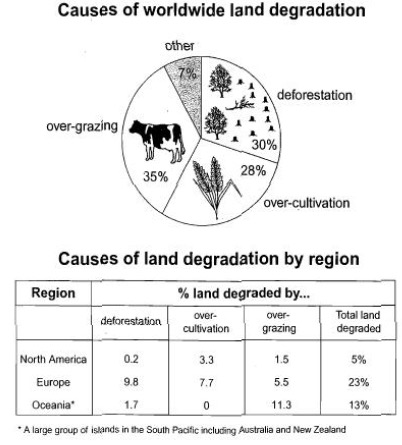

分析

**1. 本题无时间，是静态图**

**2. 这组图表由两个部分组成**

第一个是图，只有一组对比对象（导致土地退化不同的原因）

第二个是表，有两组对比对象（导致土地退化不同的原因和地区）

**3. 因此我们分成两段，一段写一个图**

不同对象说占比

相同对象互相比

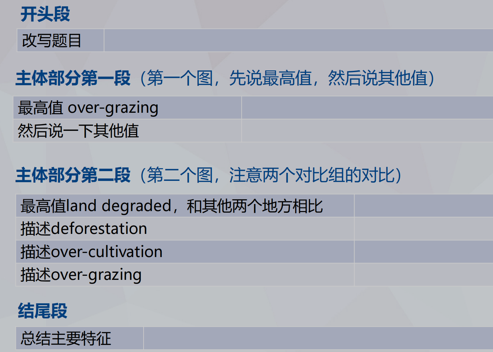

##### 1开头段

The pie chart presents information about the causes of land degradation in the world and the table shows how three regions of the world were affected by this problem.

##### **主体部分第一段**（第一个图，先说最高值，然后说其他值）

最高值是over-grazing+占比（分词结构）

Over-grazing was the main cause of the world's land degradation, with around 35% of land around the world degraded by this.

Deforestation和over-cultivation各自占30%/28%，

相比其他问题占比7%（while）

Deforestation and over-cultivation accounted for 30% and 28% of degradation respectively, while other problems made up the remaining 7% of the group.

##### **主体部分第二段**（第二个图，注意两个对比组的对比）

**最高值Land degraded，比较其他两个地方：**欧洲占比最高，几乎是Oceania的两倍，North America的四倍

Europe had the largest proportion of unproductive land at 23%, nearly twice the figure for Oceania and more than four times the level of degradation in North America.

**deforestation**：欧洲Deforestation是主要原因。而deforestation在其他两个领域占比显著更低

Deforestation was the principal reason for land degradation in Europe(9.8%) and the proportions of land degraded by this cause in other two areas were significantly lower.

**over-cultivation**：Over-cultivation是Europe另外一个问题, 导致7.7%土地受损，相比之下北美只有3.3%

Over-cultivation was another problem in Europe, causing damage to 7.7% of land, compared with 3.3% in North America.

**over-grazing**：相比之下，over-grazing在Oceania十分严重, 而在其他地区则没有这么严重

In contrast, over-grazing was severe in Oceania, reducing the productivity of 11.3% of land, but the levels of damage were lower in other two regions.

##### 2总结主体段（增加衔接）

**主体一段：** **According to the pie chart,** Over-grazing was the main cause of the world's land degradation, with around 35% of land around the world degraded by this. Deforestation and over-cultivation accounted for 30% and 28% of degradation respectively, while other problems made up the remaining 7% of the group.

**主体二段：** **It can be seen from the table that** Europe had the largest proportion of unproductive land at 23%, nearly twice the figure for Oceania and more than four times the level of degradation in North America. Deforestation was the principal reason for land degradation in Europe(9.8%) and the proportions of land degraded by this cause in other two areas were significantly lower. Over-cultivation was another problem in Europe, causing damage to 7.7% of land, compared with 3.3% in North America. In contrast, over-grazing was severe in Oceania, reducing the productivity of 11.3% of land, but the levels of damage were lower in other two regions.

##### 3总结段

over-grazing是全球土壤退化最主要原因 

欧洲比其他两个地方的土壤退化还要严重

**Overall,** over-grazing was the main problem worldwide in terms of land degradation. Europe had the highest proportion of degraded land than other two areas.

## 注意事项

1. 时态根据时间来定，与现实时间相比。不过题目的`shows(etc.)`这种永远是一般现在时

## 四、地图题

### 1. 开头段

### 2. 概述段

### 3. 主体段

#### 3.1 **主体段分段思路**

