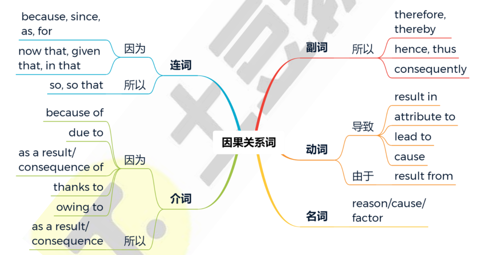
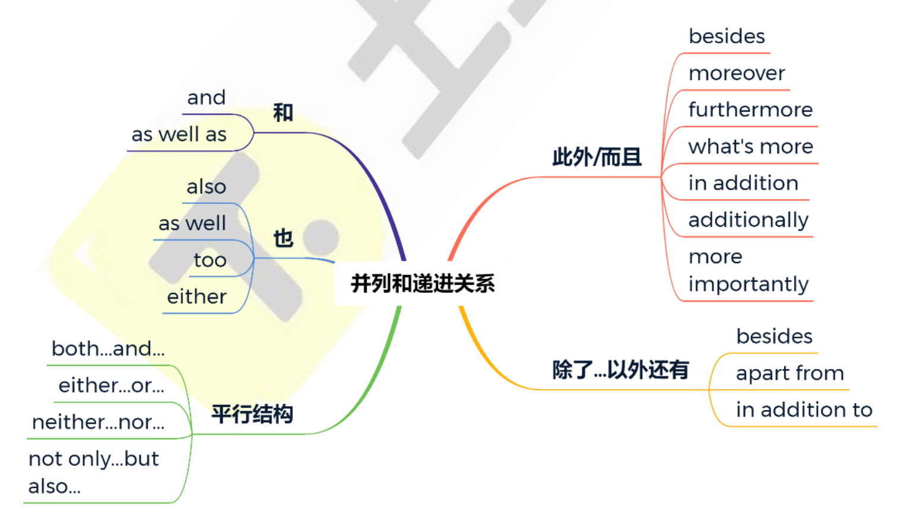

### 口语

**I think 'sth' is what l tend to go with.  sth是我常说/用(喜欢...)的**

**From what I'm told that**（据我所知）is the majority rule 大多数人说了算  so,....

English breakfast **all the way**（经常）.  我更喜欢...

absolutely 绝对是的（置后）

As far as ... be concerned 就...来说

In my case 对我而言

So nothing really to do with longer lifespans.

> **have something to do with**（与…… 有关） nothing to do with 与什么无关

### 短语

get out of 避免

**end up** 结果 最终成为

move on to the next ...  继续...

get back on track 回到正轨

personal preference 个人喜好

time is pressing 时间紧迫

serve as 充当，担任：扮演某种角色或起到某种作用。

think of/claim/believe/argue 认为

in proportion(to)(与..)成比例的;

out of proportion to sth.与某物不成比例

I definitely prefer... 我绝对喜欢...

**be attributed to** 是因为 归因于

A formed out of 由(of)...形成了A

**As a result, ... 因此**

arise from 源自于(出现)

doesn’t have a bearing 没有影响

**dedicated to 致力于**

**Instead of ..A. 否定A  = rather than而不是...**

point of view 观点/ ...的角度

take over接手

set out开始

### 句子句式

1. 

- (large) extent to (很大)某种程度上
  - **To** **some** **extent** what she argues is true.她的论证在某种程度上是符合事实的。
  - It can also impact the **extent** **to** **which**（...的程度） they enjoy life.这也会影响他们享受生活的程度。

2. You understand the **effect** Dutch elm disease `has had` when you see evidence of how prominent the tree once was.

> **effect** Dutch elm disease `has had`  表明Dutch elm disease的effect  其实就是**effect** **`that`** Dutch elm disease 

3. 虚拟语气If I **`were`** in this situation 这里必须用were而不是was

例句: If I were in your situation, I' d probably talk to them about it directly.如果我是你，我可能会直接和他们谈谈。

> 句式：**If I were in this situation, + 主句（would/could/might + 动词原形）**

- 描述 “没经历过的困难场景”：*"If I were in this situation where I had to finish a project alone with no help, I think I’d first make a detailed plan to avoid chaos."*
  （如果我处于这种 “必须独自完成项目且没人帮忙” 的场景，我会先做个详细计划避免混乱。）
- 描述 “没经历过的选择场景”：*"If I were in this situation of choosing between studying abroad and working first, I’d probably talk to my parents for advice first."*

4. I think this is such a good question because...
   用于引出一个问题或话题，并解释为什么它很重要
   例句: I think this is such a good question because it' s something we all face at some
   point. 我认为这是个非常好的问题，因为我们在某个时候都会遇到

> 1. 例句：I think this is such a good question because it makes us really think about how technology is changing our daily relationships.
>    翻译：我认为这是个非常好的问题，因为它促使我们认真思考科技正在如何改变我们的日常人际关系。
> 2. 例句：I think this is such a good question because it touches on a common worry that many young people have about their future careers.
>    翻译：我认为这是个非常好的问题，因为它触及了很多年轻人对未来职业的一个普遍担忧。
> 3. 例句：I think this is such a good question because it encourages us to look beyond the surface and understand the real reasons behind the problem.
>    翻译：我认为这是个非常好的问题，因为它鼓励我们跳出表面，去理解问题背后的真正原因。

5. I'm honestly annoyed at myself.
   表达对自己某种行为或决定感到烦恼。
   例句：'m honestly annoyed at myself for procrastinating so much.
   说实话，我对自己拖延这么多感到烦恼。

### 同义替换

convincing = persuasive - 令人信服的

identify = detect

condition = factor = reason

amend = revise - 修改 

alteration = variation = change = conversion - 改变

affecting = impressive - 动人的 

from base to tip = from bottom to top

take the place of = replace

make mind up = determination = resolution - 决心

immediate = instant  - 立刻的

spectacular = dramatic - 壮观的/令人惊叹的

straightforward = easy

move around = mobile - 四处奔波

be in accordance with  = according to - 与一致/根据按照

regulate = control

### 拼写/生词

January  February theater Saturday Wednesday Thursday Tuesday

sugar chocolate vaccine hostel towel Russia digestive 

dissociate

> 没有中文的就是拼写

inhabitant = habitant居民  linguistic语言  propose提议  **assumption**假设

meditation冥想沉思 **dispense**分发分配-- indispensable不可或缺的 extinguish熄灭扑灭---区别distinguish

**tunnel**  **manifest**显示表明   cooperation   laundry洗衣店 nightmare噩梦  canyon峡谷 Mighty强大的 

**absurd**荒诞的  resume简历/恢复 **vehicles**  **rehearsal**彩排排练 costume(s)服装--区分--Customer顾客

ferry van渡轮 货车  lodge小屋  forest   scent=odour  **irritable**暴躁敏感的(重音在前)  **spices**香料 

subtle细微的(会读)  pollution  inaccuracy  bright-feathers明亮羽毛  **compassion**同情  attendees参与者

status（美式读音 死-da-tes） rationale根本原因基本原理 nurture培养 participation  recreational娱乐的

**reintroduce**再引入   explain---explanation解释 -> 对应题目里的原因(为什么 现象 )  **prominent**著名突出的(非常好)

**prospect**可能性机会前景 ---- Prospector采矿者  **strain**压力/品种  hybrid杂交种  withstand承受抵御  **susceptible**易感染的

**dispute**争论 approve赞成否定  **proposal**建议提议计划  **feasible**可行的  posh 高雅豪华高档上流

month(s 不加es) warm  prerequisite先决条件（会读） diploma biology toilet     walking stick拐杖 

expect 希望 formal  convenient   rather相当地(rather like 喜欢/像)  rather than而不是

**strip** stripped剥开的  --区分-- stripe条纹    field trip实地考察  whereas然而   instinct天分本能  --区分-- distinct多样的 显著的

counterpart 对应的物  cache缓存（储存v.） continent大陆   continental displacement大陆位移 voyage航线航行

interpret口译 --- interpretation解释  **intermediate**中间的(会拼) - moderate中等的适度缓和 scientific community科学界 

**mat** 地垫  certificate  apron围裙(拼)  Branch manager分行经理  bank teller(银行柜员/出纳)  investment(读音没有t)

interview(面试采访)  distribution分发分配/配送  inspector检察员   sanitize 消毒 process  

label标签 -区分-  labour force劳动力  **fertilizer**  trash storm风暴(拼)  **pose造成 ** reforestation森林再造  

**conform**顺从符合   leaflet传单  Palace宫殿  museum accommodation  contemporary同时期/当代的/同辈 - peer - fellow (同事)

amusement娱乐  avenue大街 --区分-- venue场地 发生地点  specialist专家  mould模具(拼)  machinery机器(拼) 

**elastic**有弹性的(读拼)  **tyre**轮胎(拼)=tire(疲惫)  rainforest  corn谷物玉米  **disorder**混乱/紊乱(病)(拼)

exploit利用开发 miniature微小型  minority少数 weather Queen temporary  whale  slipper(s)拖鞋 soap  safe保险箱

wheelchair  coral珊瑚 reef礁石 crab螃蟹    rock pool海边的岩石区潮水潭  swan (死one)天鹅  flamingo火烈鸟

jolly愉快的 **indigenous**当地的本土的  quite time consuming有点费时间(这种结构) mastery掌握精通 -- master掌握主人硕士大师

varied  gene  receptionist  **exotic外来的**  consult咨询  underscore下划线/强调  resolute坚决地  

**composite**混合物 -- **composition**作品 subject主题学科对象  **skyscraper**摩天大楼  depict描绘  **magnify**放大 = close-up

form形式/形成   taxi  scheme方案计划(死gin)  **publicity宣传**  interpersonal人际交往=get on well with other people

canal运河(克闹)  **outskirts**郊区 vegan素食主义者   interface接口 Comfort 舒服  temperature  pregnant 

record(记录记载，不用非只带录音，什么记录都行比如maps、documents)  outline轮廓外形/大纲概述  field田地/领域

promote促进/宣传 frame框架/画框   insight见解/直觉  cast全体演员 downside缺点/负面影响 unquestionably毫无疑问的

relevance相关性/意义 port港口  vegetarian goal目标/球门  spacing字距/间隔 ingenious创造性的/精妙的  **genius**天才天赋

cutting edge前沿的  down to earth实际的务实的 restricted受限制的  **economical**经济节省的  financial财政的(拼)

insulation隔绝(热、音) evolve进化  **disperse**扩散分散 --区分-- disappear消失 inconsistent不协调不一致矛盾  

consistent持续的一致的 **implication**含义意义暗示  refute驳斥否认 dismiss解雇/去除 coastal  lawn草地 **edible**可食用的

inadequate不充分不够的  agriculture  distinctive独特的  reserve保存/reserve**s**自然保护区 remunerative报酬丰富的

**prevalent** - prevalence普遍 cattle牛 - ox - 复数oxen 公牛阉牛  cereal谷物(麦片) - grain(颗粒 - corn(玉米

deficit亏损 - deficient缺乏的 - deficiency n.  modest - humble谦虚的 approve赞成 blend混合 motif图案 oral口头的

castle城堡(拼)  pursuit追寻 destiny前途命运 - fate命运  fatal致命的 phobia恐惧  **mound**土堆 dimension空间尺寸

mutual相互的  cellar地窖 moist潮湿 - moisture水分 evaporate蒸发  outsource外包 organism生物  sequence顺序

formation结构 invaluable及其有用价值的  inform通知/**影响**  appear出现 appear to似乎 refuse material排泄物/废物

**temporary**(拼 读tempory)  pendant(挂坠) cafe timetable salt(读) toothpaste(读peister 拼)  nutrient(可数加s)

strawberry flower sign路标 anonymity匿名 /ˌæn.ɒnˈɪm.ə.ti/  **segment**部分 **virtue**美德 

